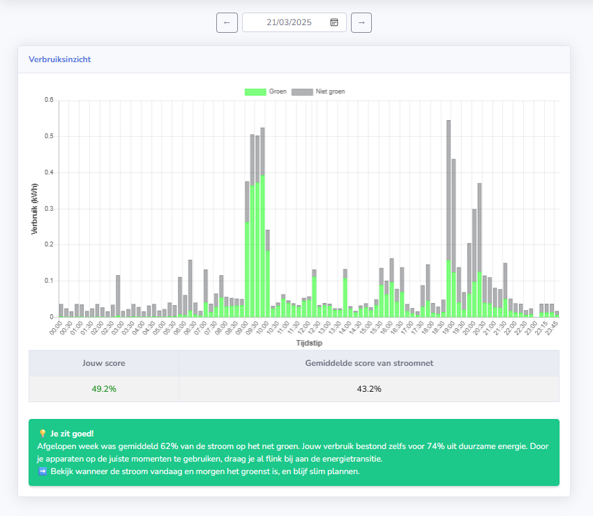
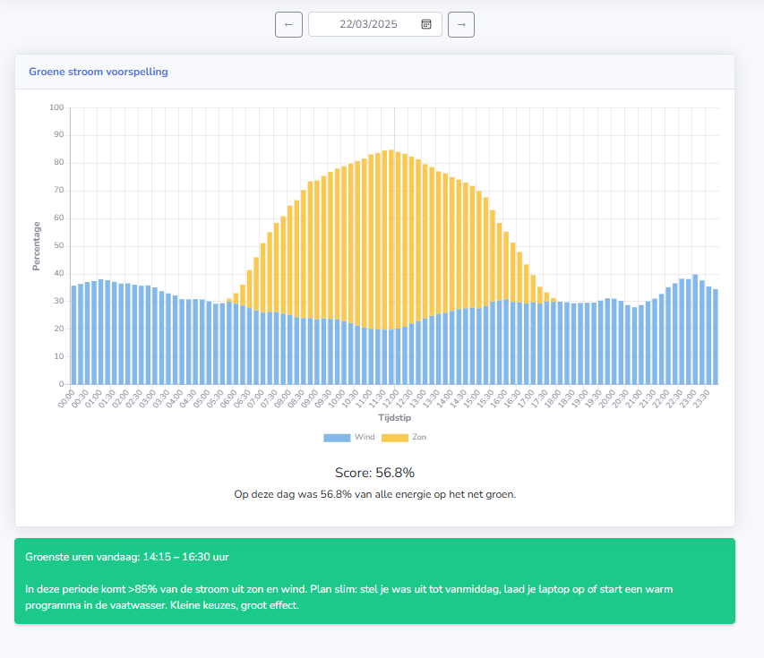

# 🌱 New Energy Hackathon 2025

Displays the amount of green energy produced on a given day using the API from the [National Energie Dashboard (NED)](https://ned-edb.atlassian.net/wiki/spaces/PAD/overview?homepageId=21004303).

The user consumption chart aligns green energy production data with smart meter usage, generating a score based on how much of a user's energy consumption occurred during periods of high renewable availability.

Developed during the New Energy Hackathon 2025 @ Gasunie, Groningen.

---

## 🚀 Live Demo

👉 [View live demo](https://new-energy-web-ca.delightfulwater-1c9907f8.westeurope.azurecontainerapps.io)


---

## 📊 Features

- Visualizes daily green energy production
- Calculates a sustainability score by aligning smart meter usage with renewable energy availability
- Integration with the NED API
- Interactive data visualizations using Chart.js
- Dockerized for easy deployment

---


## 🧰 Tech Stack


---

## ⚙️ Setup

### 🔧 Manual Setup

1. Clone the repo:

```bash
   git clone https://github.com/BencomGroupBV/NewEnergyHackathon.git

   cd NewEnergyHackathon
```

2. Update PYTHONNET_PYDLL in launchSettings.json:

```json
{
  "PYTHONNET_PYDLL": "C:\\Path\\To\\python313.dll"
}
```

3. Install dependencies:
   - .NET SDK
   - Python 3.13
   - Python.NET

4. Run the app:

```bash
   dotnet run --project NewEnergyHackathon.Web
```
---

### 🐳 Docker

To run using Docker:
```bash
docker build -t new-energy-hackathon -f NewEnergyHackathon.Web/Dockerfile .
docker run -p 5000:8080 new-energy-hackathon
```
---

## 📸 Screenshots

### Consumption insight



### Green Energy Forecast



---

## 👥 Contributors

- [@phillipRyan](https://github.com/phillipRyan)
- [@FrensBencom](https://github.com/FrensBencom)
- [@Jeroen-Maat](https://github.com/Jeroen-Maat)
- [@RonnyAtoche](https://github.com/RonnyAtoche)
- [@henkbencom](https://github.com/henkbencom)